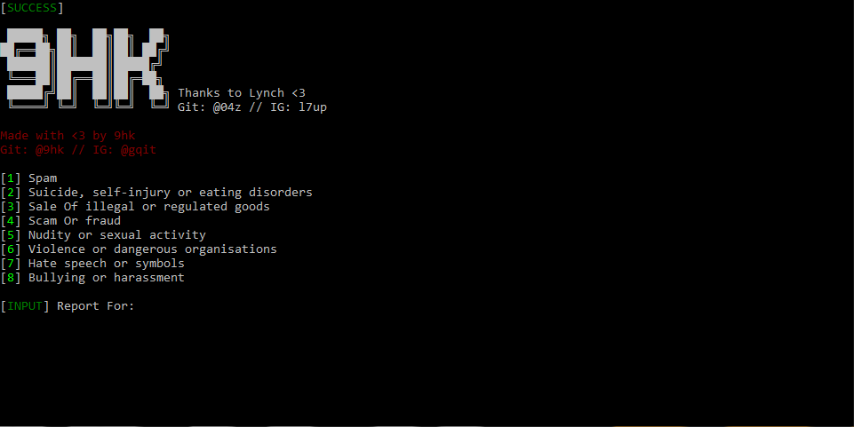
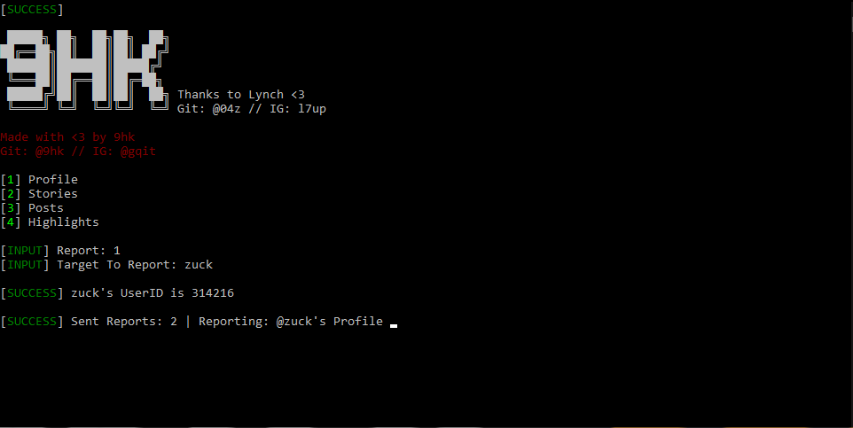

<strong>☟Scroll down to see how to use the bot☟</strong>

<strong>Linux requirements:</strong>

-Git: sudo apt-get install git

-Python: sudo apt-get install python3

-Pip: sudo apt install python3-pip

<strong>Windows requirements:</strong>

-Python

<strong>Linux installation:</strong>

git clone https://github.com/9hk/9hk-Reporter.git cd 9hk-Reporter pip3 install -r requiremenmts.txt

<strong>Windows installation:</strong>

Open CMD (ADMIN) pip install -r requirements.txt

<strong>Linux Usage:</strong>

cd CREEPorter sudo python3 IGBot.py

<strong>Windows Usage:</strong>

Open CMD python IGBot.py

Have Fun -9hk
